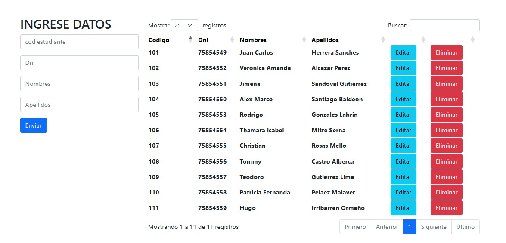

# 📚 CRUD PHP + MySQL + Bootstrap 5 + DataTables

Este proyecto implementa un sistema básico de gestión de alumnos con funcionalidades modernas como búsqueda y paginación dinámica gracias a **DataTables**, todo estilizado con **Bootstrap 5**.

---

## ⚙️ Tecnologías utilizadas

- ✅ PHP 8+
- ✅ MySQL
- ✅ Bootstrap 5
- ✅ DataTables
- ✅ Apache (XAMPP recomendado)

---

## 🔍 Características

- Registro de alumnos
- Edición y eliminación
- Búsqueda en tiempo real
- Paginación automática
- Interfaz responsiva y moderna

---

## 🖼 Vista previa

  

---
